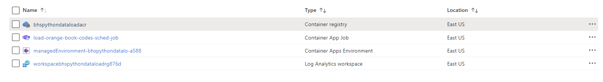
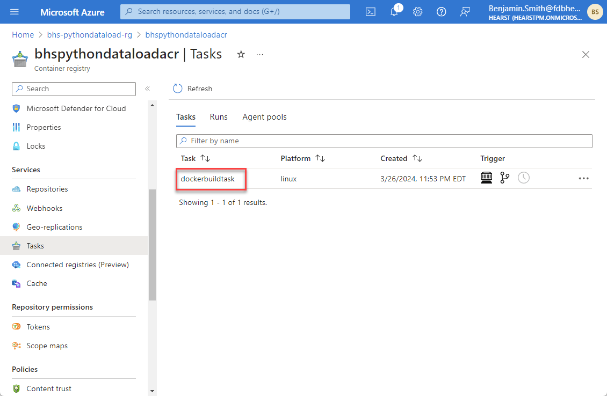
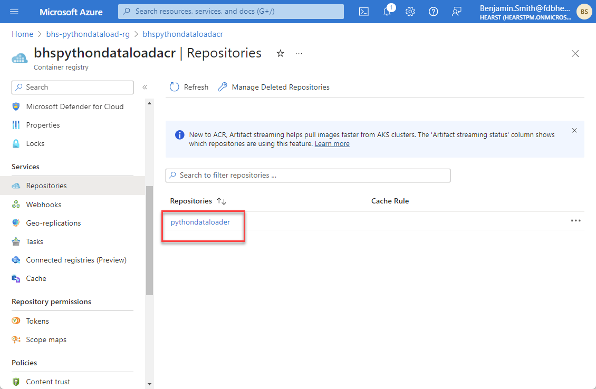
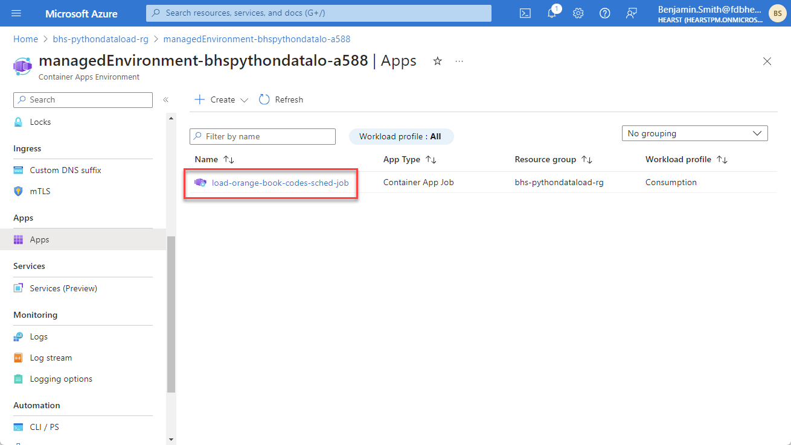
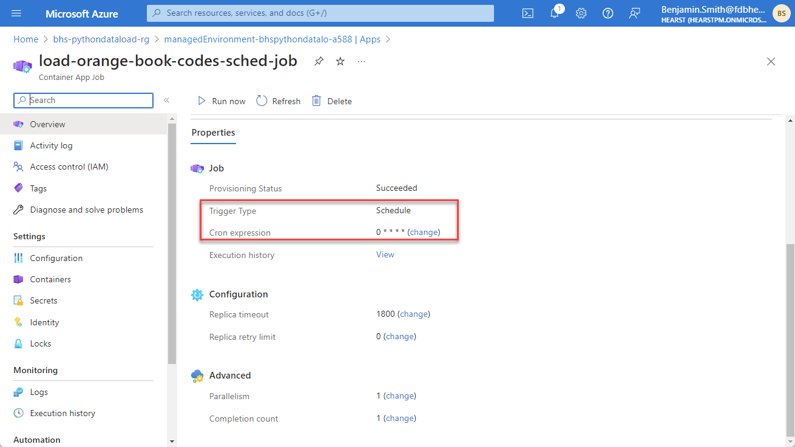
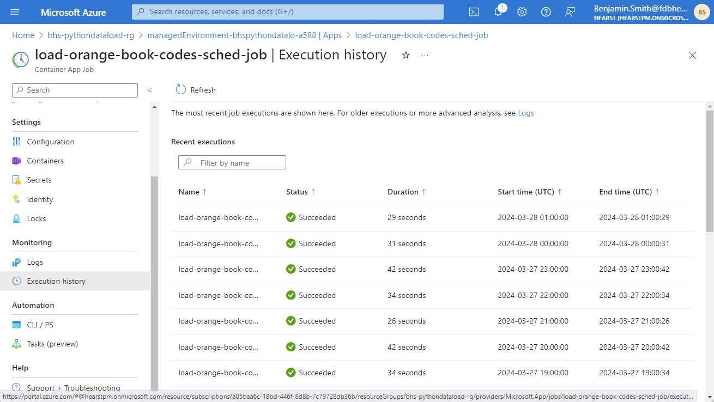
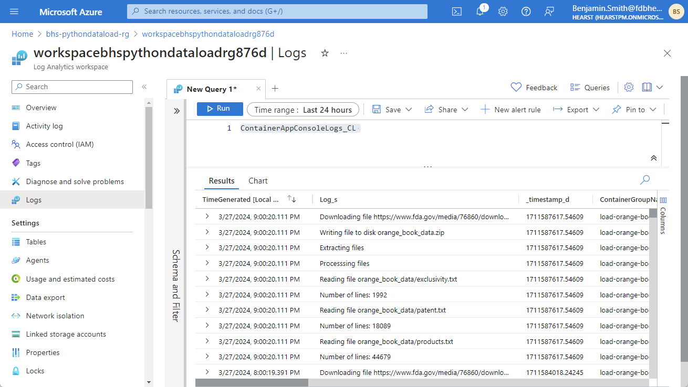

# Python script
The python script downloads a ZIP file containing Orange Book codes from the FDA website: https://www.fda.gov/drugs/drug-approvals-and-databases/orange-book-data-files

The ZIP file is saved to disk, unzipped, and then we iterate over the three text files:
1. exclusivity.txt
2. patent.txt
3. products.txt

If I were to take this project a step further, I would actually load the text file data into a database. However, for this exercise, it just prints out the line counts for each text file to the logs.

# Dockerfile
The Dockerfile is pretty simple and standard. The reqeusts library is installed via pip into the container image for use by the python script.

# Azure Resources
Summary of Azure resources used

# Container build task
The Container Registry has a Task "dockerbuildtask" that fetches the Dockerfile and python script from my GitHub repository, builds the container image, and pushes the container image to the Container Repository. The Task runs automatically for each commit made to the GitHub repository.

# Container Repository
There is a single image in the repository: "pythondataloader"

# Container Apps Environment
The [Container Apps Environment](https://learn.microsoft.com/en-us/azure/container-apps/environment) hosts one or more Container Apps. Within the Environment, I have a single Container App Job: "load-orange-book-codes-sched-job"

# Container App Job
The [Container App Job](https://learn.microsoft.com/en-us/azure/container-apps/jobs?tabs=azure-cli) has a trigger type "Schedule" and Cron expression to run the job once per hour

# Execution History
This shows the Container App Job executing once per hour.

# Log Analytics Workspace
This Azure resource is set up to capture logging information from the Container Apps Environment. Examining the logs shows the stdout captured from the python script (Downloading File, Writing to disk, Reading File, etc).
